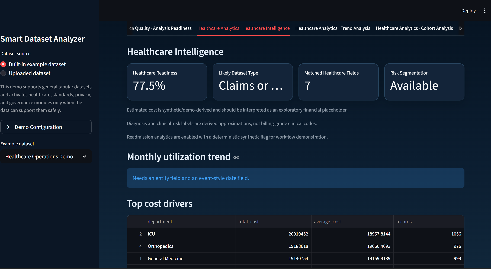
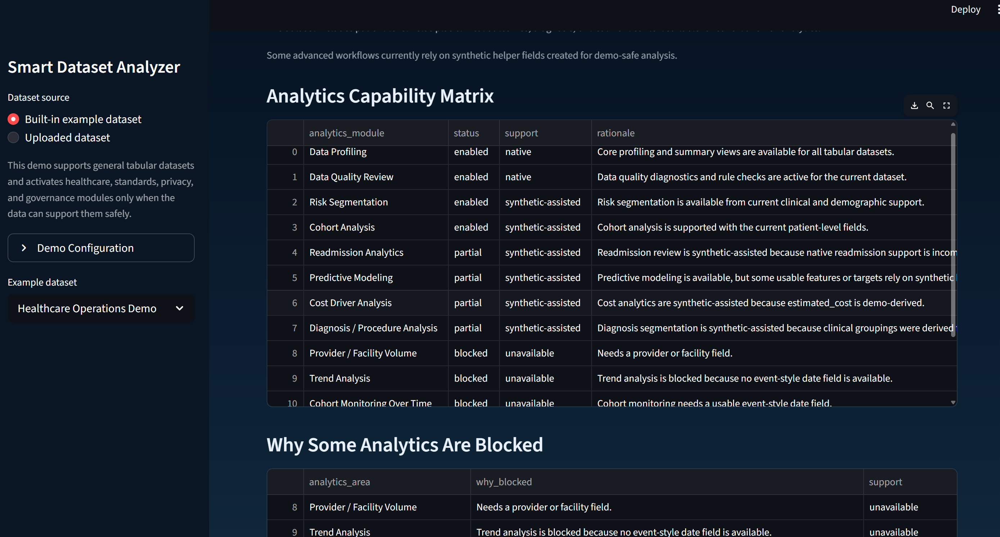
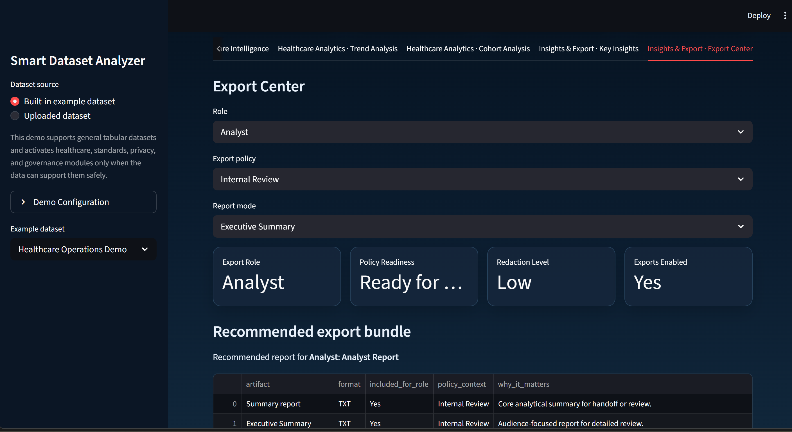

# Smart Dataset Analyzer

Smart Dataset Analyzer is an advanced **healthcare analytics and data intelligence platform** built with Python and Streamlit.  
It helps analysts and healthcare teams **profile messy datasets, detect structural and semantic patterns, unlock blocked analytics workflows, and generate stakeholder-ready reports**.

The platform combines **data profiling, remediation pipelines, predictive modeling, governance checks, and decision-support tools** into a single interactive analytics environment.

It is designed as a **portfolio-ready analytics product** that demonstrates how modern healthcare analytics systems can:

- ingest CSV or Excel datasets without assuming a fixed schema
- automatically evaluate dataset readiness for healthcare analytics
- surface clinical and operational insights only when the data supports them
- transparently disclose synthetic helper support when demo-safe augmentation is used
- generate polished executive summaries, governance views, and export-ready reports

This repository demonstrates **analytics engineering, healthcare data science, governance-aware analytics design, and product-style dashboard development** in one project.

## Why this project exists

Real-world healthcare and operational datasets are rarely clean, fully mapped, or immediately analytics-ready. This project demonstrates how a modern analytics product can:

- ingest CSV and Excel data without assuming a fixed schema
- profile and score dataset readiness automatically
- surface healthcare-specific analytics only when the data supports them
- disclose synthetic helper support transparently when demo-safe augmentation is used
- produce polished stakeholder outputs for analysts, operators, and recruiters

## Key capabilities

- Schema-flexible ingestion for CSV and Excel, including Excel sheet selection
- Structural detection for numeric, date, categorical, text, boolean, and identifier-like fields
- Semantic mapping and healthcare-aware field inference
- Data quality review, remediation guidance, and governance support
- Healthcare analytics including:
  - claims validation and utilization intelligence
  - risk segmentation
  - readmission-focused analytics
  - cohort builder and cohort monitoring
  - anomaly detection
  - benchmarking
  - care pathway and outcome intelligence
- Decision-support features including:
  - intervention recommendations
  - scenario simulation
  - executive summaries
  - prioritized insights
  - KPI benchmarking
- AI Copilot workflow planning and safe in-app action guidance
- Standards, privacy, and governance support:
  - CDISC / FHIR / HL7 readiness review
  - terminology and standards mapping support
  - PHI / PII detection and privacy review
  - lineage and audit-style summaries
- Export Center with:
  - executive report pack
  - print-friendly summaries
  - compliance and governance outputs
  - stakeholder export bundle support

## Platform Demo

### Dataset Intelligence Summary


### Analytics Capability Matrix


### Export Center


## Architecture summary

The app keeps a modular Python architecture built around a single Streamlit entrypoint.

- `app.py`
  - Streamlit UI, navigation, orchestration, export flow, and tab rendering
- `src/data_loader.py`
  - file loading, demo datasets, ingestion helpers
- `src/schema_detection.py`
  - structural detection and type heuristics
- `src/profiler.py`
  - profiling, quality summaries, numeric summaries
- `src/semantic_mapper.py`
  - semantic mapping, remediation logic, data dictionary support
- `src/remediation_engine.py`
  - BMI remediation, synthetic helper fields, audit-friendly augmentation
- `src/readiness_engine.py`
  - readiness activation and scoring
- `src/healthcare_analysis.py`
  - healthcare analytics modules and pathway/readmission/risk/claims logic
- `src/modeling_studio.py`
  - modeling, model comparison, fairness, explainability
- `src/decision_support.py`
  - executive summaries, benchmarking, scenarios, recommendations, prioritized insights
- `src/export_utils.py`
  - report builders, governance/compliance exports, manifest helpers
- `src/reports/claims_reports.py`
  - claims QC summaries, issue logs, utilization metrics, and markdown handoff reports
- `src/presentation_support.py`
  - executive report pack, print-friendly outputs, run history, governance summary
- `src/portfolio_support.py`
  - guided demo content, onboarding summaries, README-ready and screenshot-ready support content

## Built-in demo datasets

The repository includes built-in demo datasets so the app can be explored immediately:

- `Healthcare Operations Demo`
- `Healthcare Claims Demo`
- `Hospital Reporting Demo`
- `Generic Business Demo`

These are good for:

- recruiter walkthroughs
- Streamlit deployment demos
- explaining native vs synthetic support
- showing how module readiness changes with dataset structure

## Claims Validation & Utilization Engine

This module extends Clinverity into payer and claims-style healthcare analytics without breaking the app's existing schema-flexible design.

### Business problem

Claims files are often structurally usable but operationally risky: duplicate claim IDs, missing service dates, mismatched billed/allowed/paid amounts, and unclear payer or provider concentration can all weaken downstream reporting. Analysts need a workflow that validates the file and then immediately turns it into interpretable utilization signals.

### What this module validates

- claim and member identity coverage
- duplicate claim submissions or repeated claim rows
- service-date completeness
- missing billed, allowed, and paid financial fields
- negative payment values
- financial integrity mismatches such as `paid_amount > allowed_amount` and `allowed_amount > billed_amount`

### Utilization insights included

- payer-level claim and payment concentration
- provider-level utilization summaries
- diagnosis-level utilization summaries
- monthly claims trend snapshots
- flagged-claims review table for high-priority follow-up

### Example outputs

- `qc_summary.csv`
- `claims_validation_issue_log.csv`
- `utilization_metrics.csv`
- `claims_validation_report.md`

### Why this strengthens Clinverity

The claims workflow makes the platform more credible for healthcare payer, revenue integrity, and operational analytics use cases. It gives recruiters and stakeholders a concrete example of healthcare claims QC, utilization review, and governed report generation inside the same product surface as readiness, remediation, and export workflows.

### Resume-ready project bullets

- Built a healthcare Claims Validation & Utilization Engine inside Clinverity to validate claim integrity, surface payer/provider concentration, and generate recruiter-ready report artifacts.
- Added a claims-focused demo dataset with realistic member, claim, provider, diagnosis, and financial fields plus intentional integrity issues for interview-friendly walkthroughs.
- Extended the governed Export Center with claims-specific CSV and markdown outputs, including QC summaries, issue logs, utilization metrics, and a plain-English validation report.
- Preserved the existing modular architecture by implementing claims logic in reusable analytics and report modules with regression coverage and validation automation.

## Synthetic support explanation

The platform can optionally create deterministic helper fields when source data is incomplete. Examples include:

- synthetic `event_date` from a year-only field
- synthetic `estimated_cost` for blocked financial analytics
- derived diagnosis labels for demo-safe clinical segmentation
- synthetic readmission support for readmission workflow walkthroughs

These helpers are:

- disclosed explicitly in the UI
- tracked in lineage and governance summaries
- used to unlock demo-safe workflows
- not presented as source-grade clinical truth

## Demo walkthrough

Recommended walkthrough:

1. Start in `Data Intake`
   - review guided demo mode, onboarding, lineage, and production hardening
2. Open `Dataset Profile - Overview`
   - review readiness, governance summary, and executive snapshot
3. Open `Data Quality - Analysis Readiness`
   - review blockers, remediation, standards, privacy, and quick actions
4. Open `Healthcare Analytics - Healthcare Intelligence`
   - review risk, readmission, pathway, cohort, and modeling outputs
5. Finish in `Insights & Export - Export Center`
   - generate executive, governance, compliance, and stakeholder outputs

## How to run locally

Recommended Python version:

- Python 3.11 or 3.12

Setup:

```bash
python -m venv .venv
.venv\Scripts\activate
pip install -r requirements.txt
```

Optional integrations:

```bash
pip install -r requirements-optional.txt
```

This is only needed when you want one or more optional capabilities:

- `openai` for enhanced Copilot responses when `OPENAI_API_KEY` is configured
- `xgboost` for optional model-comparison support in the predictive modeling studio
- `playwright` for browser smoke tests and demo-asset tooling

Full local development and validation environment:

```bash
pip install -r requirements-dev.txt
```

Launch:

```bash
streamlit run app.py
```

## Dependency tiers

Base production/runtime dependencies live in `requirements.txt`.

Optional integrations are listed in `requirements-optional.txt`:

- `xgboost`
  - enables optional model comparison support when available
- `openai`
  - supports optional enhanced AI Copilot explanation mode if configured
- `playwright`
  - enables automated screenshot generation for demo assets

Development and broader local validation installs are grouped in `requirements-dev.txt`.

The app degrades safely when optional packages are not installed, and the startup readiness checks surface optional package and config status directly in the UI.

For container builds, the included `Dockerfile` installs only `requirements.txt` by default. Set `INSTALL_OPTIONAL_DEPS=true` at build time if you intentionally want the optional integrations in that image.

## Deployment notes

Streamlit Community Cloud style startup:

```bash
streamlit run app.py
```

Deploy this branch:

- `codex/repo-cleanup-handoff`

Entry file:

- `app.py`

Important deployment notes:

- `app.py` is the entrypoint
- built-in demo data lives under `data/`
- use `SMART_DATASET_ANALYZER_ENV` to distinguish local, staging, and production expectations
- use `SMART_DATASET_ANALYZER_SECRETS_SOURCE` to document whether secrets come from environment variables or a secret manager
- the app uses safe fallbacks when optional packages are absent
- large datasets are handled with staged sampling and diagnostics
- Docker support files are included:
- `Dockerfile`
- `.dockerignore`

See `docs/deployment.md` for a concise deployment checklist.

The repository also includes a static product layer in `landing_page.html` for demo, launch, or marketing-oriented presentation alongside the app.

## Public Links

- Landing Page:
  - `https://dhamodhar1142.github.io/clinical-outcomes-explorer/landing_page.html`
- Live App:
  - `https://clinical-outcomes-explorer-8qt5k68x3hys6saxizpaim.streamlit.app/`

## Deployment surfaces

- GitHub Pages
  - SEO and discoverability surface
  - public product overview, feature summary, and Google-indexable landing page
- Streamlit Community Cloud
  - live product surface
  - actual interactive Clinverity app for demo, upload, analysis, and export workflows

Public launch flow:

- Google -> GitHub Pages landing page -> Streamlit app

## How to make this public on Google

1. Publish the static landing page through GitHub Pages.
2. Keep the Streamlit app as the live interactive product.
3. Add the GitHub Pages URL as a property in Google Search Console.
4. Verify ownership.
5. Submit the landing page or sitemap for indexing.

The landing page should be the primary indexing target. The Streamlit app remains the interactive destination.

## GitHub Pages setup

1. Open the repository on GitHub.
2. Go to `Settings`.
3. Open `Pages`.
4. Under `Build and deployment`, choose `Deploy from a branch`.
5. Select branch `main`.
6. Select folder `/ (root)`.
7. Save.
8. Wait for GitHub Pages to publish:
   - `https://dhamodhar1142.github.io/clinical-outcomes-explorer/landing_page.html`

The repository includes:

- `index.html`
- `landing_page.html`
- `robots.txt`
- `sitemap.xml`
- `.nojekyll`

so no frontend build system is required.

## Post-launch smoke checklist

1. Confirm the GitHub Pages landing page loads.
2. Confirm `Try Live Demo` opens the Streamlit app.
3. Confirm the Streamlit app loads without a startup error.
4. Confirm `Try Demo Dataset` works in the live app.
5. Confirm a small uploaded dataset works in the live app.

### Streamlit Community Cloud steps

1. Open [https://share.streamlit.io](https://share.streamlit.io)
2. Select the repository
3. Choose branch `codex/repo-cleanup-handoff`
4. Set the entry file to `app.py`
5. Deploy

### Post-deploy smoke test

1. Confirm the app opens without a startup error
2. Confirm the first-run empty state appears when no uploaded dataset is active
3. Click `Try Demo Dataset`
4. Confirm the demo dataset loads and Overview / Readiness / Key Insights render
5. Confirm the sidebar source selector still offers `Uploaded dataset`
6. Upload a small CSV if desired and confirm the active dataset changes from demo to uploaded

## First-run product experience

The app now supports a more demo-ready first run:

- a `Try Demo Dataset` action when no uploaded dataset is active
- a guided walkthrough path:
  - upload dataset
  - view overview
  - check readiness
  - explore insights
  - export reports
- explicit runtime status indicators for:
  - uploaded vs demo dataset activity
  - sampled vs full analysis mode
  - readiness score interpretation

## CI and release safety

The repository now includes a GitHub Actions workflow that runs:

- compile validation
- unit tests
- import sanity
- browser smoke coverage

This keeps release candidates and pilot/demo builds gated on the same core checks used in local validation.

## Validation fixture strategy

The repository uses two validation fixture tiers:

- CI-friendly fixtures that stay in git:
  - `tests/fixtures/datasets/SMALL_HEALTHCARE_VISITS.csv`
  - `tests/fixtures/datasets/ALT_EHP__VIST.csv`
  - smaller malformed and ambiguous fixtures used by automated checks
- local/manual large fixture:
  - `tests/fixtures/datasets/STG_EHP__VIST.csv`

Recommended usage:

- quick validation and CI:
  - use `small-healthcare`
- local full validation and local release validation:
  - use `default` / `STG_EHP__VIST.csv`

The large full-workflow fixture is intended to be local/manual and may not be present in a fresh public clone. To restore full local validation, place the file at either:

```text
tests/fixtures/datasets/STG_EHP__VIST.csv
```

or:

```text
data/local_fixtures/STG_EHP__VIST.csv
```

or set:

```powershell
$env:SMART_DATASET_ANALYZER_LARGE_FIXTURE_PATH="C:\path\to\STG_EHP__VIST.csv"
```

See [docs/validation_automation.md](C:\Users\dhamo\OneDrive\Desktop\clinical-outcomes-explorer\docs\validation_automation.md) for the full command map and fixture behavior.

## Demo dataset guidance

Datasets that unlock the strongest demo experience usually include some combination of:

- patient or encounter identifier
- event-style date or year field
- age
- BMI or other risk signal
- diagnosis or service grouping
- department / facility / provider
- outcome or readmission-style flag
- cost or utilization fields

If those fields are incomplete, the app can still demonstrate readiness, remediation, governance, and synthetic helper support in a transparent way.

See `docs/demo_notes.md` for demo dataset suggestions and module unlock guidance.

## Limitations

- Some healthcare logic is intentionally heuristic and demo-safe rather than production clinical decision support
- Compliance, privacy, and standards outputs are readiness aids, not legal or certification determinations
- Session history, snapshots, and workflow packs are session-scoped rather than persistent across users
- Synthetic helper fields improve demo readiness but should not be treated as native clinical source truth

## Future enhancements

- richer collaboration and comments
- persistent run history and governance packs
- broader healthcare submodules for claims, population health, and EHR quality
- deeper report packaging and PDF workflows
- more advanced deployment automation

## Portfolio and presentation support

Additional recruiter/demo support files:

- `docs/demo_notes.md`
- `docs/portfolio_summaries.md`
- `docs/screenshots/README.md`
